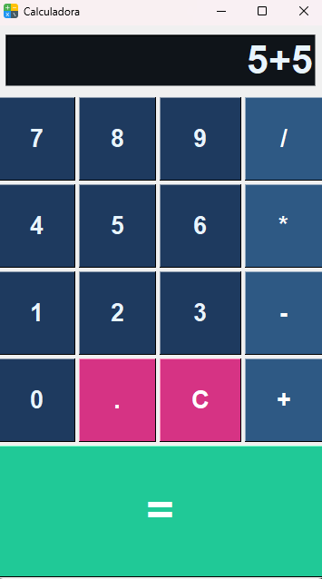

# 🧮 Tkinter Calculator

A simple desktop calculator built with Python and Tkinter. It supports basic arithmetic operations with a modern, colorful UI.

## 🚀 Features

- Basic arithmetic: addition, subtraction, multiplication, division
- Responsive UI with styled buttons
- Custom color themes for buttons and display
- Error handling for invalid expressions
- Auto format for integers vs decimals

## 📸 Screenshot



## 🛠 Technologies

- Python 3
- Tkinter (built-in Python GUI toolkit)

## 📁 Project Structure

```bash
calculator/
├── calculadora.ico         # Custom icon (Windows)
├── calculator.py           # Main application file
└── README.md               # Project description

